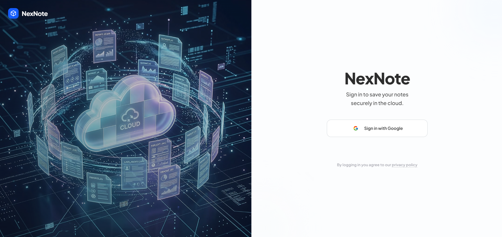
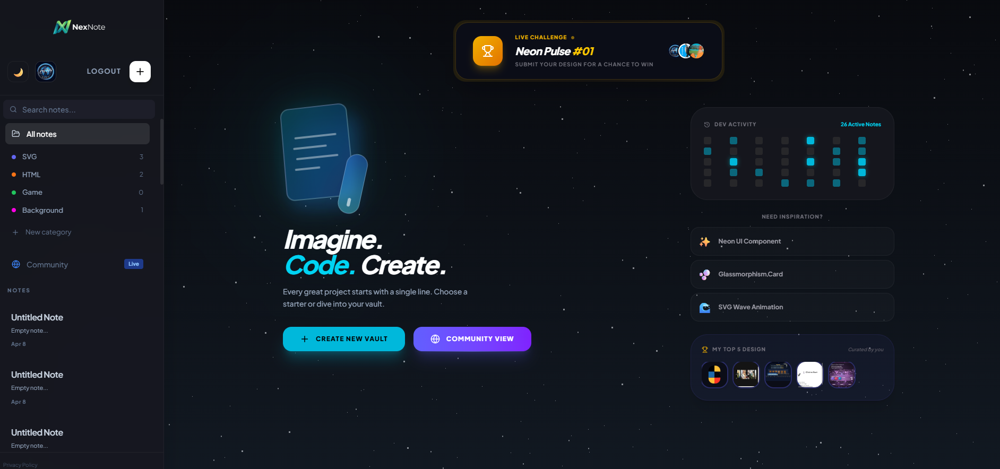
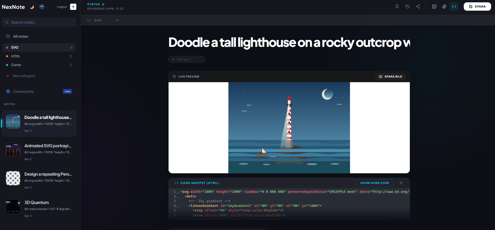
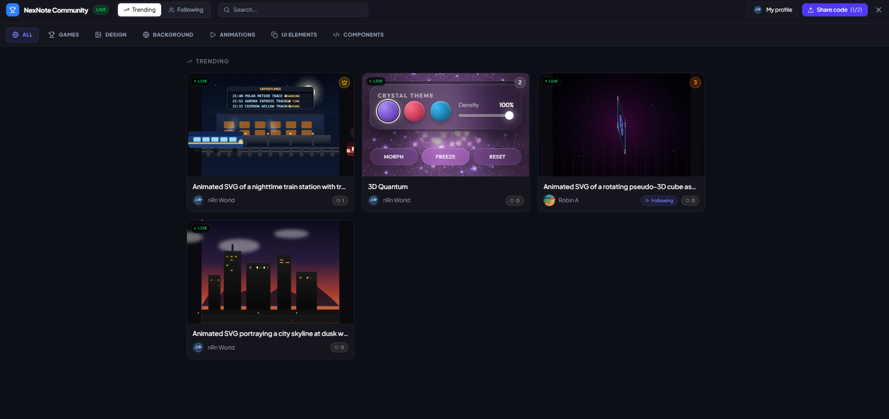
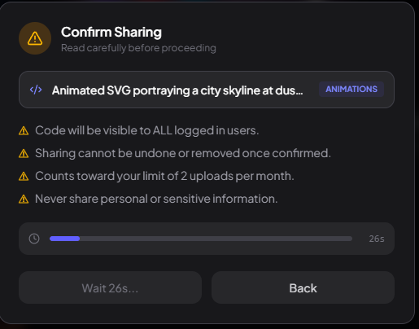
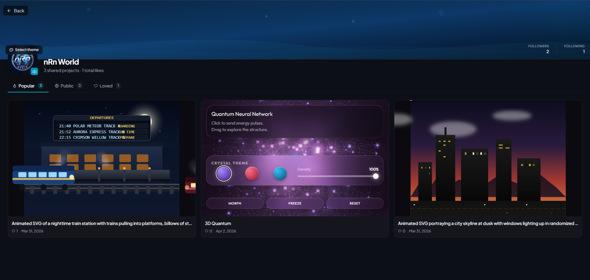

# 🚀 NexNote - Modern Code & Note Sharing Platform

<div align="center">
  
  
  [](https://reactjs.org/)
  [](https://vitejs.dev/)
  [](https://firebase.google.com/)
  [](https://tailwindcss.com/)
  
  <br />
  
  ### [🚀 Open NexNote Live Link](https://nexnote.vercel.app)
  
  [](CONTRIBUTING.md)
</div>

---

### 📝 Overview

**NexNote** is a sleek, modern platform designed for developers and creatives to store and share their favorite code snippets and notes. Built with speed and user experience in mind, NexNote allows you to manage **SVG, HTML, CSS, and JS** directly in your profile, while participating in a curated community showcase.

---

### ✨ Key Features

- 🔐 **Google Authentication**: Quick and secure sign-in with your Google account.
- 🎨 **Powerful Editors**:
  - **Rich Text Editor**: Powered by TipTap for beautiful note-taking.
  - **Code Editor**: syntax-highlighted editor for web technologies (HTML, CSS, JS, SVG).
- 🤝 **Community Sharing**: Share up to **2 projects per month** to the global community feed.
- 🌙 **Modern UI**: A responsive, dark-mode-first aesthetic built with Framer Motion for smooth transitions.
- ☁️ **Cloud Sync**: All your notes and snippets are safely stored in Firebase and synced across devices.
- 📸 **Code-to-Image**: Export your snippets as beautiful images for social media sharing.

---

### 🛠️ Tech Stack

- **Framework**: [React 19](https://react.dev/)
- **Build Tool**: [Vite 6](https://vitejs.dev/)
- **Backend/DB**: [Firebase](https://firebase.google.com/) (Auth, Firestore, Storage)
- **Styling**: [Tailwind CSS](https://tailwindcss.com/) & [Lucide Icons](https://lucide.dev/)
- **Editors**: [TipTap](https://tiptap.dev/) (Rich Text) & [CodeMirror 6](https://codemirror.net/) (Code)
- **Animations**: [Framer Motion](https://www.framer.com/motion/)

---

### 📸 Screenshots

| 🎨 Landing Page | 🏠 Dashboard |
| :---: | :---: |
|  |  |

| ✍️ Note Editor | 💻 Code Editor |
| :---: | :---: |
|  |  |

| ⚙️ Settings | 🌍 Community Feed |
| :---: | :---: |
|  |  |

---

### 🚀 Getting Started

#### Prerequisites
- Node.js (v18 or higher)
- A Firebase project

#### Installation

1. **Clone the repository:**
   ```bash
   git clone https://github.com/nRn-World/NexNote.git
   cd NexNote
   ```

2. **Install dependencies:**
   ```bash
   npm install
   ```

3. **Environment Setup:**
   Create a `.env.local` file in the root directory and add your Firebase and Gemini configurations (see `.env.example`).

4. **Run the development server:**
   ```bash
   npm run dev
   ```
   Open `http://localhost:3000` to see the result.

---

### 🤝 Contributing

We love contributors! Whether you are fixing a bug, adding a new feature, or improving documentation, your help is welcome.

- **Check open issues:** Browse the [Issues](https://github.com/nRn-World/NexNote/issues) to find something to work on.
- **Look for "good first issue":** These are perfect for new contributors.
- **Read the guide:** Check out our [Contributing Guidelines](CONTRIBUTING.md) for setup instructions.
- **Join the discussion:** Use [GitHub Discussions](https://github.com/nRn-World/NexNote/discussions) to talk about new ideas.

---

### 📜 License

This project is licensed under the **nRn World Non-Commercial License**. See the [LICENSE](LICENSE) file for more details.

---

<div align="center">
  <p>Built with ❤️ by <a href="https://github.com/nRn-World/NexNote">nRn-World</a></p>
</div>
